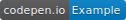

[Home](http://www.loxiumjs.com) > Advance > Writers

# Writers
[](https://codepen.io/supercide/pen/RLoRmB)

## What are they?

Writers determine how a log is serialized and where is it sent to, be it a console window, written to file or sent to a server for processing. The choice is yours however if you don't supply a writer then the default console writer will be used. This writer outputs a simple message to the console window.

## Limits

### Performance 
The number of writers you can use is limitless, chained methods will append to the existing registered writers. However excessive writers will have an impact on performance as it's another thing running in the logging pipeline.

### Scope
Modifications done inside of a writer do not persist outside of the writer to avoid any downstream effects.

## Getting Started 

### How to create and use your own writer

Writers are pretty simple, they have one method called `write` which takes a `LogMessage`, what you do with this is up to you.

### Example creating a writer
In this example, we will create a writer that will output our log messages to the console. First, let's create our writer.

```js
let consoleWriter = {
    write: function(logMessage) {
        // log logic goes here
    }
}
```

For our writer, we will be interested in the message, level, timestamp, and tags which can all be retrieved from `LogMessage`.

```js
let consoleWriter = {
    write: function(logMessage) {
        let message = logMessage.message;
        let tags = logMessage.tags;
        let timestamp = logMessage.timestamp;
        let level = loxium.LogLevel[logMessage.level];

        console.log(`${timestamp.toLocaleString()} `+ 
                    `[${level}] [Tags: ${tags.join()}] `+ 
                    `${message}`);
    }
}
```

Now all that is left for us to do is register our writer when creating the logger.
```js
let logger = builder.setMinimumLevel(loxium.LogLevel.Debug)
                    .writeTo(consoleWriter)
                    .build();
```

Now when we log something.

```js
logger.information((builder) => builder.withMessage('Hello world')
                                       .withTag('success')
                                       .withTag('example'));
```

We will get the following output
- `24/09/2017, 12:24:28 [Info] [Tags: success,example] Hello world`

[Home](http://www.loxiumjs.com) > Advance > Writers